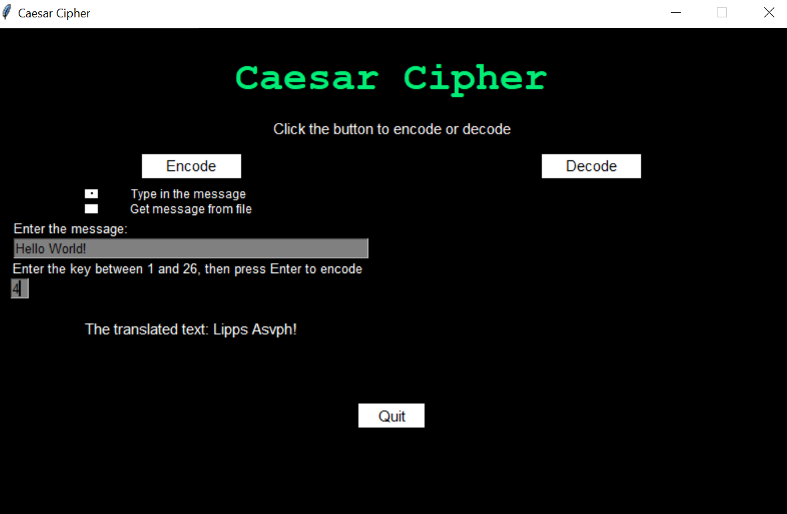

# Caesar Cipher

A Caesar Cipher encode/decoder, created in Python and John Zelle's graphics module.

## Installation

Clone this repo to your local machine and run CaeserCipher.py

## Problems and Future Updates

Add some animations
Fixes some issues with keyboard and mouse interaction

## Contributing
Pull requests are welcome. For major changes, please open an issue first to discuss what you would like to change.

Please make sure to update tests as appropriate.
